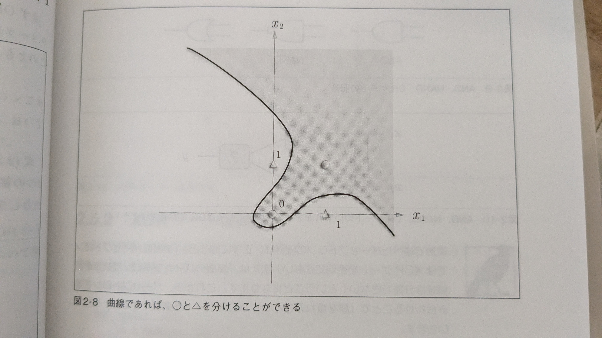

# パーセプトロン
- パーセプトロン
    - パーセプトロンはニューラルネットワークの起源のアルゴリズム
    - 仕組み
        - 入力：複数の信号、出力：一つの信号
        - 信号の種類：流す/流さない（0 or 1）
        - パーセプトロンのパラメータ（真理値）は人間が決定した（思いついた）
        - NAND、AND、OR全て同じ構造のパーセプトロンであり、異なるのはパラメータの値のみ
        - XORはパーセプトロンで実装不可能
    - パーセプトロンは層を重ねることが可能な点で素晴らしい→非線形に対応可能
- パーセプトロン（NANDなど）を重ねることで半加算機、全加算機、算術論理演算装置（ALU）、CPUとモジュールを作成していくことで、コンピュータを実装できる！

## パーセプトロン実装
y = 0  (b + w1*x1 + w2*x2 <= 0)
y = 1  (b + w1*x1 = w2*x2 > 0)
w: 重み、b: バイアス

## XORについて
- XORがパーセプトロンで実装不可能な理由
    - パーセプトロンは「パーセプトロン実装」で述べたように、二次元上で見たときに直線で分断することが可能
    - 
        - 画像のように、直線（線形）では分断することが不可能 
### 線形、非線形
- 線形：直線で分断
- 非線形：画像のように、曲線で分断
### XOR実装

''' mermaid
graph TD;
    A[OR] --> B[AND]
    C[NAND] --> B
'''
上記の形式で実装可能
これは二層パーセプトロンと呼ぶことにする（重み計算が二層分あるためだが、この定義は諸説あり）

