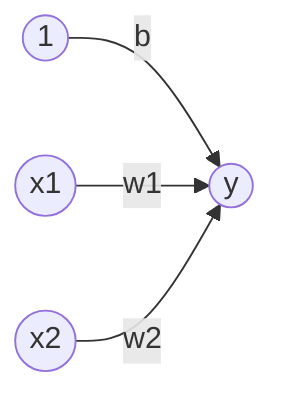
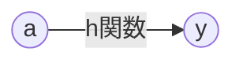

# ニューラルネットワーク
- パーセプトロンについて
    - 利点：理論上層を重ねることで、複雑な処理が可能
    - 欠点：人間の手でパーセプトロンのパラメータを決定する必要がある
        - ニューラルネットワークが自動でパラメータ設定するようにした
- パーセプトロン復習
    - b: バイアス（ニューロンの発火をコントロール）
    - w: 重み（各信号の重要度をコントロール）
### 簡素なネットワーク
<!-- flowchart だけだと上から下に図が伸びる。LRは右から左に伸びる。-->

**y = h( b + w1*X1 + w2*x2 )** （0: x<=0, 1: x>0）で式が表される。

## 活性化関数について
- 活性化関数の意味
    - 入力信号の総和をどう活性化（発火）するかを決定する役割
    - 重みつき入力信号の総和 → 活性化関数で変換
        - a = b + w1*X1 + w2*x2
        - y = h(a)
    - つまり、上記のネットワークの y の部分が以下の図のようになるということ（aからyへの変換まとめて一つのノードとして、ネットワークはみる）

### ステップ関数
- ステップ関数、階段関数
    - y = h(x)  ( 0: x<=0, 1: x>0 ）
    - 上記の式のように、閾値を境にして出力が変化する関数
    - つまりパーセプトロンはステップ関数と言える
- ニューラルネットワークとパーセプトロンの主な違いは活性化関数にある

### シグモイド関数
<!-- インライン表示：$一つで囲む、ブロック表示：$$二つで囲む-->
$$h(x) = \frac{1}{1+exp(-x)}$$
＜出力例＞
$$h(0.1) = 0.731...$$$$h(0.2) = 0.880...$$

### ステップ関数、シグモイド関数の比較
- 異なる点
    - ステップ関数：急に出力を０を境に変化させる、シグモイド関数：滑らかに変化する（**滑らかさがニューラルネットワークの学習では重要**）
    - ステップ関数：０または１のみ、シグモイド関数：0.731...など連続的な実数値
- 共通点
    - 入力が小さいときは０に近く、入力が大きいときは１に近づいていく
    - ０〜１の範囲に収まる
    - 非線形関数：入力の定数倍ではない
- ニューラルネットワークでは活性化関数に線形関数を用いてはいけない
    - なぜなら、線形関数を用いると層を深くする意味がなくなる
    - 線形関数$h(x) = cx$の時、3層のネットワークの出力は$c^3x$となって、$a = c^3$の一回の掛け算で実装できてしまって意味がない
    - ただし、途中の層での出力がどうなっているかを確認できる

### ReLU関数
- 最近はReLUが多い
$$\begin{equation}
  \left\{ 
  \begin{alignedat}{2}   
    x & \ \ \ (x > 0)\\   
    0 & \ \ \ (x <= 0) 
  \end{alignedat} 
  \right.
\end{equation}$$

### 恒等関数
- 恒等関数：入力＝出力
- 隠れ層の活性化関数h(x)に対して、出力層はσ()
- 出力層の活性化関数において
    - 回帰問題：恒等関数
    - 2クラス分類：シグモイド関数
    - 多クラス分類：ソフトマックス関数

### ソフトマックス関数
$$\sigma(y_k) = \frac{exp(a_k)}{\sum_{i} exp(a_i)}$$
上記を式変形すると、、、
$$\sigma(y_k) = \frac{exp(a_k + C')}{\sum_{i} exp(a_i + C')}\\
（C' = logC）$$
と表すことができて、exp(1000)などによるinfでのオーバーフロー対策ができる。
- 特性
    - 上記の式より、総和は必ず１となる
        - そのため、確率のように捉えることが可能
        - 各ソフトマックス関数の出力がそれぞれの確率とみれる
    - ソフトマックス関数を適応しても、各項それぞれの大小関係は変わらない
        - ニューラルネットワークのクラス分類において、最も大きな値のクラスを選択するため、ソフトマックス関数を適応しなくても良いとわかる
        - 計算量を減らすために省略すべきだが、推論時ではなく（上記は推論時）、学習時に良い効果がある

