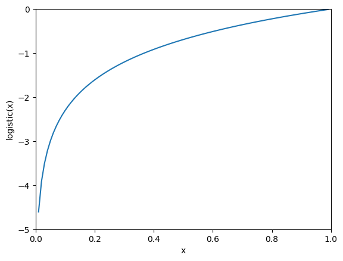
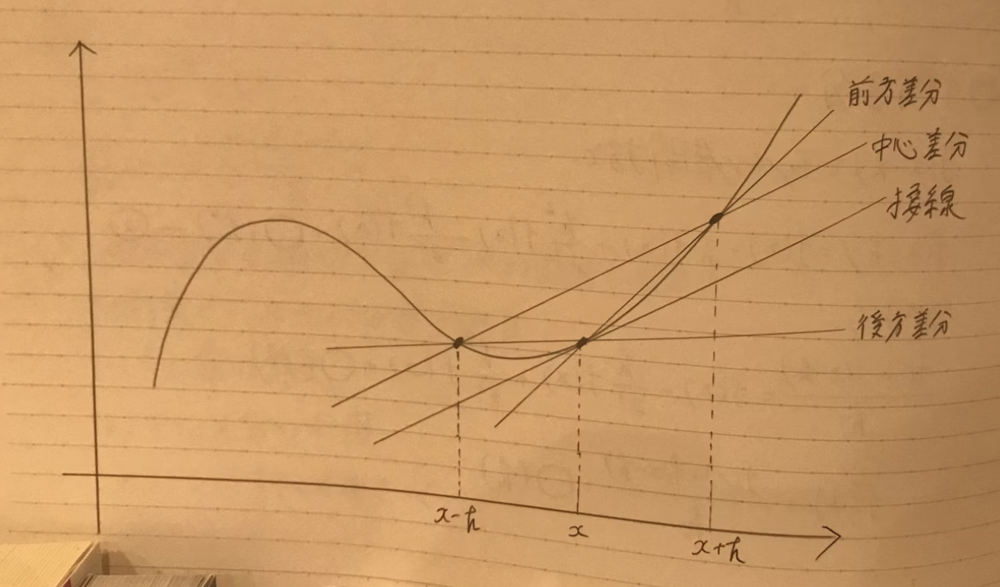

# 4章 ニューラルネットワークの学習
学習：訓練データから最適な重みを計算すること
損失関数という指標を小さくするように重みを決定する．
この章では「勾配法」を利用する．
## 4.1 データから学習する
パーセプトロンは3個程度のパラメータであり，手作業で決定できる範囲内だが，数千以上のパラメータを持つニューラルネットワークでは不可能という前提．
### データ駆動
- データ駆動：データから答えを探し・パターンを見つけ・ストーリーを語る（人中心のアプローチからの脱却）
- 5を判別する規則を人間が導き出すことは，難題である
    - 画像から特徴量を抽出，特徴量のパターンを学習する
    - 特徴量：
        - 入力データ（入力画像）から本質的なデータ（重要なデータ）を的確に抽出できるようにする変換器
        - 画像の特徴量はベクトル表記
        - 5識別においては，「カーブの数」「丸くなっている箇所の数」などが特徴量に該当し，人の手で選択する必要がある
- 図4-2
    - 1: 重みも特徴量も人の手
    - 2: 人の手でどの特徴量を使うか決定し，機械学習
    - 3: 特徴量も機械学習もコンピュータで行う
### 訓練データとテストデータ
- 訓練データ（教師データ）：学習＆最適パラメータの決定
- テストデータ：モデル評価
- 汎化能力
    - 訓練データ以外のデータに対する能力(最終的にここを伸ばす)
    - 過学習(特定のデータセットだけに過度に適応した状態)を避ける必要がある
## 4.2 損失関数
- 幸せ指標の例え
    - 幸せ指標というものを自分で決定して，それを頼りに最適な幸せを目指していく
    - ニューラルネットワークも指標を頼りに，最適パラメータを探していく＝**損失関数**
- 損失関数
    - ＋：性能の悪さ
    - ー：性能の良さ
    - 損失関数の行う本質的意味は同じ
### ２乗和誤差
$$E = \frac{1}{2} \sum_{k} \; (y_k - t_k)^2 $$
$$
\left\{
\begin{array}{ll}
y_k = \text{ニューラルネットワークの出力} \\
t_k = \text{教師データ} \\
k = \text{データの次元数}
\end{array}
\right.
$$
- one-hot表現：正解ラベルのみ1とし，それ以外を0とする
### 交差エントロピー誤差
$$E = - \sum_{k} \; t_k \; \log \; y_k$$
$$
\left\{
\begin{array}{ll}
y_k = \text{ニューラルネットワークの出力} \\
t_k = \text{正解ラベル(one-hot表現)} \\
\end{array}
\right.
$$

- 性質
    - logxは０に近づくと小さくなっていく＝交差エントロピーは大きくなる
    - logxは１に近づくと０に近づいていく（０で１出力）
### ミニバッチ学習
- 機械学習では全ての訓練データに対する損失関数の和を指標とする
### 交差エントロピー（ミニバッチ対応）
$$E = - \frac{1}{N} \sum_{n} \sum_{k} \; t_{nk} \; \log \; y_{nk}$$
$$
\left\{
\begin{array}{ll}
y_{nk} = \text{ニューラルネットワークの出力} \\
t_{nk} = \text{n個目のデータのone-hot表現におけるk番目の正解ラベル} \\
N =　\text{Nで割って正規化(訓練データの数によらない統一した値となる)}
\end{array}
\right.
$$
- ミニバッチ学習：データが大きい場合，データの一部を近似として無作為取得＆学習(例：視聴率計測のために1000世帯を対象に計測)
### 損失関数の意義
Q：最終目的が認識精度ならば，認識精度を指標とすべきではないか？
- 認識精度の場合
    - 微分しても変化がほとんど０である
    - 例：100枚中32枚正しく認識しているとき
        - 問題点１：パラメータを少し変えても，精度はほとんど変わらない
        - 問題点２：精度が変化したとしても32％→33％のように不連続
    - ステップ関数も同様で，０以外で傾き０であるため，パラメータの微細変化が傾き０に抹殺されるところが問題
- 損失関数の場合
    - 微分して，損失を小さくなる方に増減させ，傾き０を目指していく
    - 少しのパラメータ変化で連続的に変化するため，嬉しい
    - シグモイド関数はステップ関数と反対に，微細変化を持つため，ニューラルネットワークの正しい学習につながる
## 4.3 数値微分
微分とは
$$\frac{df(x)}{dx} = lim_{h→0} \frac{f(x+h)-f(x)}{h}$$
- 数値微分：
    - 微小な差分によって微分を求めること
    - 前方差分（x+h - x）は誤差が発生
    - 中心差分（x+h - x-h）は誤差を減らすことが可能
- 解析的
    - 数式的微分で求めること
    - 誤差が発生しない真の微分とも呼べる

## 4.4 勾配
勾配（gradient）とは，すべての変数の偏微分ベクトルをまとめたもの
$$
\mathrm{gradient} = 
\begin{bmatrix}
\frac{\partial f}{\partial x_0} & \frac{\partial f}{\partial x_1}
\end{bmatrix}
$$
- **勾配の指し示す方向は関数の値を最も減らす方向である**
- 故に，一番低い地点のみを指し示すとは限らない
### 勾配法
- 勾配法の目的：関数の最小値（またはできるだけ小さな値）を探すこと
    - 最適なパラメータ＝損失関数が最小値の時
- 勾配降下法：最小値を探す場合
- 勾配上昇法：最大値を探す場合
    - 符号を反転するだけなため，特に違いはない
- 注意点
    - 最小値ではなく，極小値・鞍点など傾き０の場所が他にもあること
    - プラトー：学習が進まない停滞期がある
$$x_0 = x_0 - η\frac{∂f}{∂x_0}$$
$$x_1 = x_1 - η\frac{∂f}{∂x_1}$$
$$η = 学習率（パラメータの更新度合い）$$
学習率＝ハイパーパラメータ（自動で獲得する重みではなく，人間の手で設定されるパラメータ）
###　ニューラルネットワークに対する勾配
$$W = 
\begin{bmatrix}
w_{11} & w_{12} & w_{13} \\
w_{21} & w_{22} & w_{23}
\end{bmatrix}$$
$$\frac{∂L}{∂W} = 
\begin{bmatrix}
\frac{∂L}{∂w_{11}} & \frac{∂L}{∂w_{12}}  & \frac{∂L}{w_{13}} \\
\frac{∂L}{w_{21}} & \frac{∂L}{w_{22}} & \frac{∂L}{w_{23}}
\end{bmatrix}$$
## 4.5 学習アルゴリズム
### ニューラルネットワークの手順
- step1：ミニバッチ
    - ランダムに一部のデータを選び，損失関数を減らすことを目的とする
- step2：勾配算出
    - 損失関数を減らす方向を示す勾配を，各重みごとに求める
- step3：パラメータ更新
    - パラメータを勾配方向に微小量更新
- step4；繰り返し
**確率的勾配降下法（SGD）**：ミニバッチとして無作為選出データを利用しているため
- epochとは
    - すべての訓練データを使い切った回数